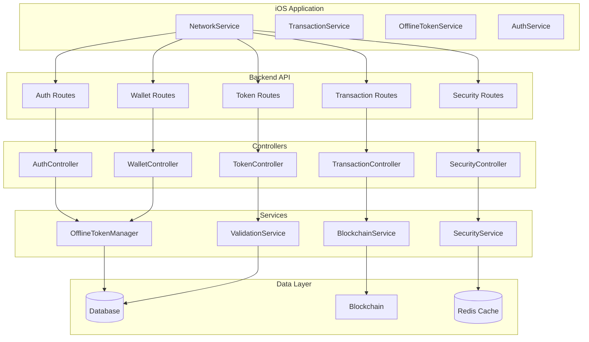

# API Integration Fixes - Design Document

## Overview

This design addresses the critical API integration gaps between the iOS mobile application and the backend services. The solution focuses on implementing missing endpoints, standardizing response formats, and ensuring seamless communication between the mobile app and backend systems.

The design follows RESTful API principles, maintains backward compatibility where possible, and implements proper error handling and security measures throughout all API interactions.

## Architecture

### High-Level Architecture



### API Endpoint Structure

The API will be organized into the following main categories:

1. **Authentication** (`/api/v1/auth`)
2. **Wallet Management** (`/api/v1/wallet`)
3. **Transaction Operations** (`/api/v1/transactions`)
4. **Token Management** (`/api/v1/tokens`)
5. **Security Operations** (`/api/v1/security`)

## Components and Interfaces

### 1. Transaction Management Components

#### TransactionController
Handles all transaction-related operations with proper validation and error handling.

**Key Methods:**
- `submitTransaction()` - Process transaction submissions from iOS
- `syncTransactions()` - Handle transaction synchronization
- `getTransactionStatus()` - Retrieve transaction status information
- `syncOfflineTransactions()` - Process offline transaction data

**Response Formats:**
```typescript
interface TransactionSubmissionResponse {
  transactionId: string;
  status: TransactionStatus;
  blockchainTxHash?: string;
  timestamp: Date;
  estimatedConfirmation?: Date;
}

interface TransactionSyncResponse {
  transactions: Transaction[];
  lastSyncTimestamp: Date;
  totalCount: number;
  hasMore: boolean;
}
```

#### TransactionService
Business logic for transaction processing and validation.

**Key Features:**
- Transaction validation and signature verification
- Double-spending prevention
- Offline transaction queue management
- Blockchain integration for transaction broadcasting

### 2. Token Management Components

#### TokenController
Handles token validation, division, and management operations.

**Key Methods:**
- `validateToken()` - Verify token authenticity and status
- `divideToken()` - Handle token division for change-making
- `getPublicKeys()` - Return public key database in expected format

**Response Formats:**
```typescript
interface TokenValidationResponse {
  valid: boolean;
  token: {
    id: string;
    amount: number;
    ownerId: string;
    signature: string;
    isSpent: boolean;
    expiresAt: Date;
    createdAt: Date;
  };
  validationDetails: {
    signatureValid: boolean;
    notExpired: boolean;
    notSpent: boolean;
    ownershipValid: boolean;
  };
}

interface TokenDivisionResponse {
  originalToken: {
    id: string;
    amount: number;
    status: string;
  };
  paymentToken: OfflineToken;
  changeToken?: OfflineToken;
}

interface PublicKeyDatabase {
  publicKeys: {
    [userId: string]: {
      publicKey: string;
      walletAddress: string;
      lastUpdated: Date;
    };
  };
  otmPublicKey: string;
  version: string;
}
```

### 3. Enhanced Wallet Components

#### WalletController Enhancements
Extended wallet controller with additional endpoints for iOS compatibility.

**New Methods:**
- `getWalletBalance(walletId)` - Get balance for specific wallet ID
- `getWalletHistory()` - Retrieve paginated transaction history
- `estimateTransactionCost()` - Calculate transaction fees and costs

**Enhanced Response Format:**
```typescript
interface WalletBalanceResponse {
  walletId: string;
  walletAddress: string;
  balances: {
    blockchain: {
      amount: number;
      currency: string;
      lastUpdated: Date;
    };
    offline: {
      amount: number;
      tokenCount: number;
      lastUpdated: Date;
    };
    pending: {
      amount: number;
      transactionCount: number;
    };
  };
  totalBalance: number;
}
```

### 4. Security Integration Components

#### SecurityController Integration
Enhanced security controller with mobile-specific endpoints.

**New Methods:**
- `getMobileSecurityStatus()` - Security status tailored for mobile
- `reportSecurityEvent()` - Allow mobile to report security events
- `getSecurityRecommendations()` - Provide security guidance for mobile users

### 5. Authentication Enhancement Components

#### AuthController Improvements
Enhanced authentication with proper token management.

**Enhanced Methods:**
- `refreshToken()` - Proper token refresh implementation
- `validateSession()` - Session validation for mobile apps
- `revokeAllTokens()` - Security feature for compromised accounts

## Data Models

### Enhanced Transaction Model
```typescript
interface Transaction {
  id: string;
  type: TransactionType;
  senderId: string;
  receiverId: string;
  amount: number;
  status: TransactionStatus;
  tokenIds: string[];
  senderSignature?: string;
  receiverSignature?: string;
  blockchainTxHash?: string;
  timestamp: Date;
  metadata?: TransactionMetadata;
  createdAt: Date;
  updatedAt: Date;
}

interface TransactionMetadata {
  connectionType?: string;
  deviceInfo?: string;
  bluetoothDeviceId?: string;
  errorMessage?: string;
  retryCount?: number;
  gasPrice?: string;
  gasLimit?: string;
  blockNumber?: number;
}
```

### Enhanced Token Model
```typescript
interface OfflineToken {
  id: string;
  amount: number;
  signature: string;
  issuer: string;
  issuedAt: Date;
  expirationDate: Date;
  isSpent: boolean;
  spentAt?: Date;
  divisions: TokenDivision[];
  ownerId: string;
  parentTokenId?: string;
  createdAt: Date;
  updatedAt: Date;
}

interface TokenDivision {
  amount: number;
  signature: string;
  createdAt: Date;
}
```

### Response Wrapper Model
```typescript
interface ApiResponse<T = any> {
  success: boolean;
  data?: T;
  error?: {
    code: string;
    message: string;
    details?: any;
  };
  message?: string;
  timestamp: string;
  requestId?: string;
}
```

## Error Handling

### Standardized Error Responses

All API endpoints will return consistent error responses:

```typescript
interface ErrorResponse {
  success: false;
  error: {
    code: ErrorCode;
    message: string;
    details?: {
      field?: string;
      reason?: string;
      validationErrors?: ValidationError[];
    };
  };
  timestamp: string;
  requestId: string;
}

enum ErrorCode {
  VALIDATION_ERROR = 'VALIDATION_ERROR',
  AUTHENTICATION_REQUIRED = 'AUTHENTICATION_REQUIRED',
  AUTHORIZATION_FAILED = 'AUTHORIZATION_FAILED',
  RESOURCE_NOT_FOUND = 'RESOURCE_NOT_FOUND',
  RATE_LIMIT_EXCEEDED = 'RATE_LIMIT_EXCEEDED',
  BLOCKCHAIN_ERROR = 'BLOCKCHAIN_ERROR',
  INSUFFICIENT_BALANCE = 'INSUFFICIENT_BALANCE',
  TOKEN_EXPIRED = 'TOKEN_EXPIRED',
  TOKEN_ALREADY_SPENT = 'TOKEN_ALREADY_SPENT',
  DOUBLE_SPENDING_DETECTED = 'DOUBLE_SPENDING_DETECTED',
  INVALID_SIGNATURE = 'INVALID_SIGNATURE',
  NETWORK_ERROR = 'NETWORK_ERROR',
  INTERNAL_SERVER_ERROR = 'INTERNAL_SERVER_ERROR'
}
```

### Error Handling Strategy

1. **Input Validation Errors**: Return 400 with detailed field-level errors
2. **Authentication Errors**: Return 401 with clear authentication requirements
3. **Authorization Errors**: Return 403 with permission details
4. **Resource Not Found**: Return 404 with resource identification
5. **Business Logic Errors**: Return 422 with business rule explanations
6. **Server Errors**: Return 500 with error tracking information

## Testing Strategy

### Unit Testing
- **Controllers**: Test all endpoint handlers with mock dependencies
- **Services**: Test business logic with various input scenarios
- **Validators**: Test input validation with edge cases
- **Error Handlers**: Test error response formatting

### Integration Testing
- **API Endpoints**: Test complete request-response cycles
- **Database Operations**: Test data persistence and retrieval
- **External Services**: Test blockchain and third-party integrations
- **Authentication Flow**: Test complete auth workflows

### Mobile Integration Testing
- **iOS-Backend Communication**: Test all API calls from iOS NetworkService
- **Response Format Validation**: Ensure iOS can parse all responses
- **Error Handling**: Test iOS error handling for all error scenarios
- **Offline Queue Processing**: Test offline-to-online synchronization

### Performance Testing
- **Load Testing**: Test API performance under concurrent requests
- **Response Time Testing**: Ensure sub-2-second response times
- **Memory Usage**: Monitor memory consumption during operations
- **Database Performance**: Test query performance with large datasets

### Security Testing
- **Authentication Testing**: Test token validation and refresh
- **Authorization Testing**: Test access control for all endpoints
- **Input Sanitization**: Test protection against injection attacks
- **Rate Limiting**: Test rate limiting effectiveness

## Implementation Phases

### Phase 1: Core Transaction API (High Priority)
1. Implement complete transaction submission endpoint
2. Fix transaction synchronization endpoint
3. Implement transaction status tracking
4. Add offline transaction processing

### Phase 2: Token Management API (High Priority)
1. Implement token validation endpoint
2. Add token division functionality
3. Fix public key database response format
4. Enhance token lifecycle management

### Phase 3: Wallet API Enhancement (Medium Priority)
1. Add parameterized wallet balance endpoint
2. Implement wallet transaction history
3. Add transaction cost estimation
4. Enhance balance response format

### Phase 4: Security Integration (Medium Priority)
1. Add mobile security status endpoints
2. Implement security event reporting
3. Add security recommendations API
4. Enhance fraud detection integration

### Phase 5: Performance and Monitoring (Low Priority)
1. Add performance monitoring endpoints
2. Implement advanced caching strategies
3. Add request tracing and debugging
4. Optimize database queries

## Security Considerations

### Authentication and Authorization
- JWT token validation on all protected endpoints
- Proper token refresh mechanism implementation
- Session management for mobile applications
- Multi-factor authentication support preparation

### Data Protection
- Input sanitization and validation
- SQL injection prevention
- XSS protection for any web interfaces
- Sensitive data encryption in transit and at rest

### API Security
- Rate limiting per user and IP
- Request size limitations
- CORS configuration for mobile apps
- API versioning for backward compatibility

### Blockchain Security
- Transaction signature validation
- Double-spending prevention
- Secure key management
- Audit logging for all blockchain operations

## Monitoring and Observability

### Logging Strategy
- Structured logging with correlation IDs
- Security event logging
- Performance metrics logging
- Error tracking and alerting

### Metrics Collection
- API response times and success rates
- Transaction processing metrics
- Token operation statistics
- User activity patterns

### Health Monitoring
- Endpoint health checks
- Database connectivity monitoring
- Blockchain service availability
- External service dependencies

### Alerting
- Critical error notifications
- Performance degradation alerts
- Security incident notifications
- Service availability alerts