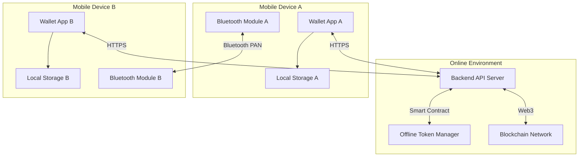
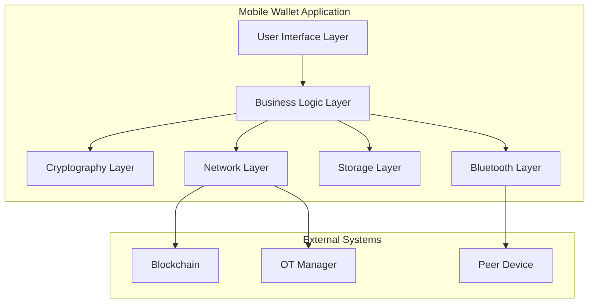

# Design Document

## Overview

The Offline Blockchain Wallet System is a mobile application that enables secure cryptocurrency transactions in environments with limited or no internet connectivity. The system uses a hybrid approach combining blockchain technology with offline token management, leveraging Bluetooth for peer-to-peer communication and cryptographic signatures for security.

### Key Design Principles

- **Offline-First Architecture**: Core transaction functionality works without internet connectivity
- **Cryptographic Security**: All transactions are cryptographically signed and verified
- **Token Divisibility**: Support for precise payments with change calculation
- **Automatic Management**: Self-managing token lifecycle with expiration handling
- **Cross-Platform Compatibility**: Designed for iOS with potential Android expansion

## Architecture

### Development Scope Separation

The system is divided into two main development tracks:

#### Mobile App Development (iOS/Swift)
- **Wallet Application**: Native iOS app with offline capabilities
- **Bluetooth Communication**: Peer-to-peer transaction handling
- **Local Storage**: Offline token and transaction management
- **Cryptographic Operations**: Client-side signing and verification
- **User Interface**: QR codes, balance display, transaction history
- **Background Services**: Auto-purchase, expiration monitoring

#### Backend Development (Node.js/Ethereum)
- **API Server**: RESTful API for wallet operations
- **Smart Contract**: Ethereum-based token management
- **Offline Token Manager (OTM)**: Token issuance and redemption
- **Blockchain Integration**: Web3 connectivity and transaction broadcasting
- **Database**: User accounts, transaction logs, public key management
- **Security Services**: Authentication, rate limiting, monitoring

### High-Level System Architecture



### Component Architecture



## Components and Interfaces

### Mobile App Components (iOS/Swift)

#### 1. User Interface Layer

**Responsibilities:**
- Display wallet balances (OT and blockchain)
- Transaction history and status
- QR code generation and scanning
- Bluetooth connection management
- Settings and configuration

**Key Interfaces:**
- `WalletViewController`: Main wallet interface
- `TransactionViewController`: Send/receive transactions
- `QRCodeViewController`: QR code scanning and generation
- `HistoryViewController`: Transaction history display
- `SettingsViewController`: App configuration

### 2. Business Logic Layer

**Core Services:**

#### OfflineTokenService
```typescript
interface OfflineTokenService {
  purchaseTokens(amount: number): Promise<OfflineToken[]>
  validateToken(token: OfflineToken): boolean
  divideToken(token: OfflineToken, amount: number): TokenDivision
  markTokenAsSpent(tokenId: string): void
  getAvailableBalance(): number
  handleExpiredTokens(): Promise<void>
}
```

#### TransactionService
```typescript
interface TransactionService {
  initiateTransaction(recipientId: string, amount: number): Transaction
  processIncomingTransaction(transaction: Transaction): Promise<boolean>
  signTransaction(transaction: Transaction, privateKey: string): SignedTransaction
  verifyTransaction(transaction: SignedTransaction): boolean
  syncWithBlockchain(): Promise<void>
}
```

#### BluetoothService
```typescript
interface BluetoothService {
  startAdvertising(walletInfo: WalletInfo): void
  scanForDevices(): Promise<BluetoothDevice[]>
  connectToDevice(device: BluetoothDevice): Promise<BluetoothConnection>
  sendData(connection: BluetoothConnection, data: any): Promise<void>
  receiveData(connection: BluetoothConnection): Promise<any>
}
```

### 3. Cryptography Layer

**Key Management:**
- Generate and store private/public key pairs
- Secure key storage using iOS Keychain
- Digital signature creation and verification
- Token integrity validation

**Cryptographic Operations:**
```typescript
interface CryptographyService {
  generateKeyPair(): KeyPair
  signData(data: any, privateKey: string): string
  verifySignature(data: any, signature: string, publicKey: string): boolean
  encryptData(data: any, publicKey: string): string
  decryptData(encryptedData: string, privateKey: string): any
}
```

### 4. Network Layer

**Blockchain Integration:**
- Web3 connection management
- Smart contract interaction
- Transaction broadcasting
- Balance synchronization

**API Communication:**
```typescript
interface NetworkService {
  connectToBlockchain(): Promise<Web3Connection>
  callSmartContract(method: string, params: any[]): Promise<any>
  broadcastTransaction(transaction: SignedTransaction): Promise<string>
  getBlockchainBalance(address: string): Promise<number>
  fetchPublicKeys(): Promise<PublicKeyDatabase>
}
```

### 5. Storage Layer

**Local Data Management:**
- Offline token storage
- Transaction history
- User preferences
- Cryptographic keys (via Keychain)

**Data Models:**
```typescript
interface OfflineToken {
  id: string
  amount: number
  signature: string
  issuer: string
  expirationDate: Date
  isSpent: boolean
}

interface Transaction {
  id: string
  senderId: string
  receiverId: string
  amount: number
  timestamp: Date
  type: 'online' | 'offline'
  status: 'pending' | 'completed' | 'failed'
  signature?: string
}
```

#### 6. Bluetooth Layer

**Peer-to-Peer Communication:**
- Device discovery and pairing
- Secure data transmission
- Connection management
- Protocol handling

### Backend Components (Node.js/Express)

#### 1. API Gateway Layer

**Responsibilities:**
- Request routing and validation
- Authentication and authorization
- Rate limiting and throttling
- Response formatting and error handling

**Key Endpoints:**
- `POST /api/auth/login`: User authentication
- `GET /api/wallet/balance`: Get blockchain balance
- `POST /api/tokens/purchase`: Purchase offline tokens
- `POST /api/tokens/redeem`: Redeem offline tokens
- `GET /api/keys/public`: Get public key database

#### 2. Offline Token Manager (OTM)

**Core Services:**

```typescript
interface OfflineTokenManager {
  issueTokens(userId: string, amount: number): Promise<SignedToken[]>
  validateTokenSignature(token: OfflineToken): boolean
  redeemTokens(tokens: OfflineToken[]): Promise<BlockchainTransaction>
  handleExpiredTokens(userId: string): Promise<RefundTransaction>
  getPublicKey(): string
}
```

#### 3. Blockchain Service Layer

**Smart Contract Integration:**
- Token transfer operations
- Balance queries
- Transaction broadcasting
- Event monitoring

```typescript
interface BlockchainService {
  deployContract(): Promise<string>
  transferTokens(from: string, to: string, amount: number): Promise<string>
  getBalance(address: string): Promise<number>
  broadcastTransaction(signedTx: string): Promise<string>
  monitorEvents(): void
}
```

#### 4. Database Layer

**Data Management:**
- User account storage
- Transaction history
- Token issuance records
- Public key registry

**Database Schema:**
```sql
-- Users table
CREATE TABLE users (
  id UUID PRIMARY KEY,
  wallet_address VARCHAR(42) UNIQUE,
  public_key TEXT,
  created_at TIMESTAMP,
  updated_at TIMESTAMP
);

-- Offline tokens table
CREATE TABLE offline_tokens (
  id UUID PRIMARY KEY,
  user_id UUID REFERENCES users(id),
  amount DECIMAL(18,8),
  signature TEXT,
  issued_at TIMESTAMP,
  expires_at TIMESTAMP,
  redeemed_at TIMESTAMP,
  status VARCHAR(20)
);

-- Transactions table
CREATE TABLE transactions (
  id UUID PRIMARY KEY,
  sender_id UUID REFERENCES users(id),
  receiver_id UUID REFERENCES users(id),
  amount DECIMAL(18,8),
  type VARCHAR(20),
  status VARCHAR(20),
  blockchain_tx_hash VARCHAR(66),
  created_at TIMESTAMP
);
```

#### 5. Security and Monitoring

**Security Services:**
- JWT token management
- Request validation
- Fraud detection
- Audit logging

**Monitoring Services:**
- Performance metrics
- Error tracking
- Transaction monitoring
- System health checks

## Data Models

### Core Data Structures

#### OfflineToken
```json
{
  "id": "uuid-string",
  "amount": 100.50,
  "signature": "cryptographic-signature",
  "issuer": "otm-public-key",
  "issuedAt": "2025-01-15T10:30:00Z",
  "expirationDate": "2025-02-15T10:30:00Z",
  "isSpent": false,
  "spentAt": null,
  "divisions": []
}
```

#### Transaction
```json
{
  "id": "uuid-string",
  "type": "offline_transfer",
  "senderId": "sender-wallet-id",
  "receiverId": "receiver-wallet-id",
  "amount": 25.75,
  "timestamp": "2025-01-20T14:45:00Z",
  "status": "completed",
  "tokenIds": ["token-uuid-1", "token-uuid-2"],
  "senderSignature": "sender-signature",
  "receiverSignature": "receiver-signature",
  "metadata": {
    "connectionType": "bluetooth",
    "deviceInfo": "iPhone 15 Pro"
  }
}
```

#### WalletState
```json
{
  "walletId": "wallet-uuid",
  "publicKey": "public-key-string",
  "offlineBalance": 250.00,
  "blockchainBalance": 1500.75,
  "lastSyncTimestamp": "2025-01-20T12:00:00Z",
  "autoRechargeEnabled": true,
  "autoRechargeThreshold": 50.00,
  "autoRechargeAmount": 200.00
}
```

## Error Handling

### Error Categories

1. **Network Errors**
   - Connection timeouts
   - Blockchain unavailability
   - API service errors

2. **Cryptographic Errors**
   - Invalid signatures
   - Key corruption
   - Decryption failures

3. **Bluetooth Errors**
   - Pairing failures
   - Connection drops
   - Data transmission errors

4. **Business Logic Errors**
   - Insufficient balance
   - Expired tokens
   - Double spending attempts

### Error Handling Strategy

```typescript
interface ErrorHandler {
  handleNetworkError(error: NetworkError): void
  handleCryptographicError(error: CryptoError): void
  handleBluetoothError(error: BluetoothError): void
  handleBusinessLogicError(error: BusinessError): void
  logError(error: Error, context: string): void
}
```

**Error Recovery Mechanisms:**
- Automatic retry with exponential backoff
- Graceful degradation to offline mode
- User notification with actionable options
- Transaction queuing for later processing

## Testing Strategy

### Unit Testing
- Individual component testing
- Cryptographic function validation
- Business logic verification
- Mock external dependencies

### Integration Testing
- Bluetooth communication testing
- Blockchain interaction testing
- End-to-end transaction flows
- Error scenario testing

### Security Testing
- Penetration testing
- Cryptographic audit
- Key management validation
- Transaction integrity verification

### Performance Testing
- Bluetooth connection speed
- Transaction processing time
- Battery usage optimization
- Memory usage profiling

### Test Scenarios

1. **Happy Path Testing**
   - Complete offline transaction flow
   - Automatic token purchase
   - Token expiration and restoration

2. **Edge Case Testing**
   - Network interruption during sync
   - Bluetooth disconnection during transfer
   - Simultaneous transactions
   - Token expiration edge cases

3. **Security Testing**
   - Forged transaction attempts
   - Double spending prevention
   - Key compromise scenarios
   - Man-in-the-middle attacks

4. **Performance Testing**
   - Large transaction volumes
   - Multiple simultaneous connections
   - Extended offline periods
   - Battery optimization

## Security Considerations

### Cryptographic Security
- **Key Management**: Private keys stored in iOS Keychain with hardware security module support
- **Digital Signatures**: ECDSA with secp256k1 curve for blockchain compatibility
- **Token Integrity**: Each offline token cryptographically signed by OTM
- **Transaction Verification**: Multi-layer signature verification (OTM + user signatures)

### Network Security
- **TLS Encryption**: All API communications use TLS 1.3
- **Certificate Pinning**: Prevent man-in-the-middle attacks
- **API Authentication**: JWT tokens with short expiration times
- **Rate Limiting**: Prevent abuse and DoS attacks

### Bluetooth Security
- **Encrypted Pairing**: Use Bluetooth LE with AES encryption
- **Device Verification**: Verify peer device is legitimate wallet app
- **Data Integrity**: Hash verification for transmitted data
- **Connection Timeout**: Automatic disconnection after inactivity

### Application Security
- **Code Obfuscation**: Protect against reverse engineering
- **Root/Jailbreak Detection**: Prevent running on compromised devices
- **Secure Storage**: Encrypt sensitive data at rest
- **Audit Logging**: Comprehensive security event logging

## Performance Optimization

### Bluetooth Optimization
- **Connection Pooling**: Reuse established connections
- **Data Compression**: Minimize transmission overhead
- **Batch Operations**: Group multiple transactions
- **Background Processing**: Handle transfers in background

### Storage Optimization
- **Database Indexing**: Optimize query performance
- **Data Archiving**: Move old transactions to archive
- **Cache Management**: Intelligent caching strategies
- **Compression**: Compress stored transaction data

### Battery Optimization
- **Background App Refresh**: Minimize background activity
- **Bluetooth Low Energy**: Use BLE for device discovery
- **CPU Optimization**: Efficient cryptographic operations
- **Network Batching**: Batch API calls to reduce radio usage

### Memory Management
- **Object Pooling**: Reuse expensive objects
- **Lazy Loading**: Load data on demand
- **Memory Monitoring**: Track and optimize memory usage
- **Garbage Collection**: Proper cleanup of resources