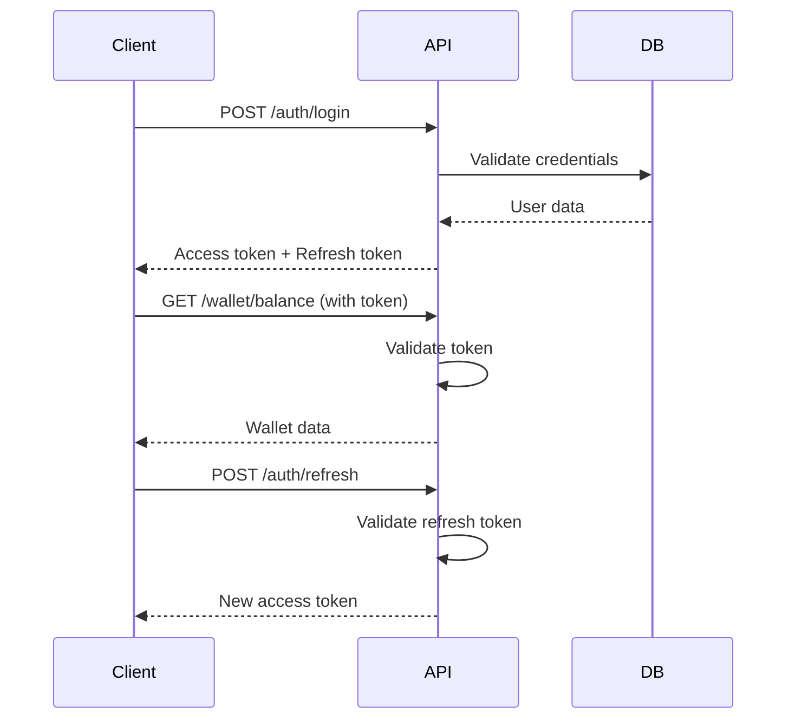

# Backend API Documentation

## 🎯 Overview

The Offline Blockchain Wallet Backend API is a RESTful service built with Node.js, TypeScript, and Express.js. It provides secure endpoints for wallet management, token operations, and blockchain integration.

## 🚀 Quick Start

### Prerequisites
- Node.js 18+
- PostgreSQL 13+
- Redis 6+
- npm or yarn

### Installation

```bash
# Clone repository
git clone <repository-url>
cd backend

# Install dependencies
npm install

# Setup environment
cp .env.example .env
# Edit .env with your configuration

# Setup database
npm run db:setup
npm run db:migrate
npm run db:seed

# Start development server
npm run dev
```

### Environment Configuration

```bash
# Server Configuration
PORT=3000
NODE_ENV=development
API_VERSION=v1

# Database Configuration
DB_HOST=localhost
DB_PORT=5432
DB_NAME=wallet_db
DB_USER=wallet_user
DB_PASSWORD=your_secure_password
DB_SSL=false

# JWT Configuration
JWT_SECRET=your_jwt_secret_key_here
JWT_EXPIRES_IN=24h
JWT_REFRESH_EXPIRES_IN=7d

# Blockchain Configuration
ETH_RPC_URL=https://mainnet.infura.io/v3/your_infura_key
ETH_PRIVATE_KEY=0x...
CONTRACT_ADDRESS=0x...
GAS_LIMIT=21000
GAS_PRICE=20000000000

# Redis Configuration
REDIS_URL=redis://localhost:6379
REDIS_PASSWORD=
REDIS_DB=0

# Security Configuration
RATE_LIMIT_WINDOW_MS=900000  # 15 minutes
RATE_LIMIT_MAX_REQUESTS=100
BCRYPT_SALT_ROUNDS=12

# Monitoring Configuration
LOG_LEVEL=info
METRICS_ENABLED=true
HEALTH_CHECK_INTERVAL=30000
```

## 📁 Project Structure

```
backend/
├── src/
│   ├── controllers/          # Request handlers
│   │   ├── authController.ts
│   │   ├── walletController.ts
│   │   ├── tokenController.ts
│   │   └── transactionController.ts
│   ├── services/            # Business logic
│   │   ├── authService.ts
│   │   ├── walletService.ts
│   │   ├── tokenService.ts
│   │   ├── blockchainService.ts
│   │   └── offlineTokenManager.ts
│   ├── database/            # Database layer
│   │   ├── connection.ts
│   │   ├── dao/            # Data Access Objects
│   │   └── migrations/     # Database migrations
│   ├── middleware/          # Express middleware
│   │   ├── auth.ts
│   │   ├── rateLimiter.ts
│   │   ├── errorHandler.ts
│   │   └── validation.ts
│   ├── routes/              # API routes
│   │   ├── auth.ts
│   │   ├── wallet.ts
│   │   ├── tokens.ts
│   │   └── transactions.ts
│   ├── models/              # Data models
│   │   ├── User.ts
│   │   ├── Wallet.ts
│   │   ├── Transaction.ts
│   │   └── OfflineToken.ts
│   ├── utils/               # Utility functions
│   │   ├── logger.ts
│   │   ├── crypto.ts
│   │   └── validation.ts
│   ├── config/              # Configuration
│   │   ├── config.ts
│   │   ├── database.ts
│   │   └── swagger.ts
│   └── types/               # TypeScript types
│       └── index.ts
├── contracts/               # Smart contracts
│   ├── OfflineWalletToken.sol
│   └── migrations/
├── scripts/                 # Deployment scripts
│   ├── deploy.ts
│   ├── migrate.ts
│   └── seed.ts
├── test/                    # Test files
│   ├── unit/
│   ├── integration/
│   └── e2e/
└── infrastructure/          # Infrastructure configs
    ├── docker/
    ├── nginx/
    └── monitoring/
```

## 🔐 Authentication

### JWT Token Authentication

All protected endpoints require a valid JWT token in the Authorization header:

```
Authorization: Bearer <jwt-token>
```

### Token Lifecycle

1. **Login**: Get access token and refresh token
2. **Access**: Use access token for API calls
3. **Refresh**: Use refresh token to get new access token
4. **Logout**: Invalidate both tokens

### Authentication Flow



## 📚 API Endpoints

### Authentication Endpoints

#### POST /api/auth/register

Register a new user account.

**Request Body:**
```json
{
  \"username\": \"john_doe\",
  \"email\": \"john@example.com\",
  \"password\": \"SecurePass123!\",
  \"confirmPassword\": \"SecurePass123!\"
}
```

**Response (201):**
```json
{
  \"success\": true,
  \"data\": {
    \"user\": {
      \"id\": \"550e8400-e29b-41d4-a716-446655440000\",
      \"username\": \"john_doe\",
      \"email\": \"john@example.com\",
      \"walletAddress\": \"0x742d35Cc6634C0532925a3b8D404d3aAB451e9c\",
      \"createdAt\": \"2024-01-15T10:30:00Z\"
    },
    \"tokens\": {
      \"accessToken\": \"eyJhbGciOiJIUzI1NiIsInR5cCI6IkpXVCJ9...\",
      \"refreshToken\": \"eyJhbGciOiJIUzI1NiIsInR5cCI6IkpXVCJ9...\",
      \"expiresIn\": \"24h\"
    }
  }
}
```

**Validation Rules:**
- Username: 3-30 characters, alphanumeric and underscore only
- Email: Valid email format
- Password: Minimum 8 characters, must contain uppercase, lowercase, number, and special character

#### POST /api/auth/login

Authenticate user and receive access tokens.

**Request Body:**
```json
{
  \"email\": \"john@example.com\",
  \"password\": \"SecurePass123!\"
}
```

**Response (200):**
```json
{
  \"success\": true,
  \"data\": {
    \"user\": {
      \"id\": \"550e8400-e29b-41d4-a716-446655440000\",
      \"username\": \"john_doe\",
      \"email\": \"john@example.com\",
      \"walletAddress\": \"0x742d35Cc6634C0532925a3b8D404d3aAB451e9c\"
    },
    \"tokens\": {
      \"accessToken\": \"eyJhbGciOiJIUzI1NiIsInR5cCI6IkpXVCJ9...\",
      \"refreshToken\": \"eyJhbGciOiJIUzI1NiIsInR5cCI6IkpXVCJ9...\",
      \"expiresIn\": \"24h\"
    }
  }
}
```

#### POST /api/auth/refresh

Refresh access token using refresh token.

**Request Body:**
```json
{
  \"refreshToken\": \"eyJhbGciOiJIUzI1NiIsInR5cCI6IkpXVCJ9...\"
}
```

**Response (200):**
```json
{
  \"success\": true,
  \"data\": {
    \"accessToken\": \"eyJhbGciOiJIUzI1NiIsInR5cCI6IkpXVCJ9...\",
    \"expiresIn\": \"24h\"
  }
}
```

#### POST /api/auth/logout

Invalidate user tokens.

**Headers:**
```
Authorization: Bearer <access-token>
```

**Request Body:**
```json
{
  \"refreshToken\": \"eyJhbGciOiJIUzI1NiIsInR5cCI6IkpXVCJ9...\"
}
```

**Response (200):**
```json
{
  \"success\": true,
  \"message\": \"Successfully logged out\"
}
```

### Wallet Endpoints

#### GET /api/wallet/balance

Get current wallet balance and token information.

**Headers:**
```
Authorization: Bearer <access-token>
```

**Response (200):**
```json
{
  \"success\": true,
  \"data\": {
    \"walletAddress\": \"0x742d35Cc6634C0532925a3b8D404d3aAB451e9c\",
    \"balances\": {
      \"blockchain\": {
        \"amount\": 1250.75,
        \"currency\": \"ETH\",
        \"lastUpdated\": \"2024-01-15T10:30:00Z\"
      },
      \"offline\": {
        \"amount\": 125.50,
        \"tokenCount\": 5,
        \"lastUpdated\": \"2024-01-15T09:45:00Z\"
      },
      \"pending\": {
        \"amount\": 25.00,
        \"transactionCount\": 2
      }
    },
    \"totalBalance\": 1401.25
  }
}
```

#### POST /api/wallet/purchase

Purchase tokens for offline use.

**Headers:**
```
Authorization: Bearer <access-token>
```

**Request Body:**
```json
{
  \"amount\": 100.00,
  \"paymentMethod\": \"ethereum\",
  \"transactionHash\": \"0x1234567890abcdef...\",
  \"gasPrice\": \"20000000000\",
  \"gasLimit\": \"21000\"
}
```

**Response (201):**
```json
{
  \"success\": true,
  \"data\": {
    \"transactionId\": \"550e8400-e29b-41d4-a716-446655440001\",
    \"tokens\": [
      {
        \"id\": \"token-uuid-1\",
        \"amount\": 25.00,
        \"signature\": \"0x3045022100...\",
        \"expiresAt\": \"2024-02-15T10:30:00Z\",
        \"createdAt\": \"2024-01-15T10:30:00Z\"
      },
      {
        \"id\": \"token-uuid-2\",
        \"amount\": 25.00,
        \"signature\": \"0x3045022100...\",
        \"expiresAt\": \"2024-02-15T10:30:00Z\",
        \"createdAt\": \"2024-01-15T10:30:00Z\"
      },
      {
        \"id\": \"token-uuid-3\",
        \"amount\": 25.00,
        \"signature\": \"0x3045022100...\",
        \"expiresAt\": \"2024-02-15T10:30:00Z\",
        \"createdAt\": \"2024-01-15T10:30:00Z\"
      },
      {
        \"id\": \"token-uuid-4\",
        \"amount\": 25.00,
        \"signature\": \"0x3045022100...\",
        \"expiresAt\": \"2024-02-15T10:30:00Z\",
        \"createdAt\": \"2024-01-15T10:30:00Z\"
      }
    ],
    \"totalAmount\": 100.00,
    \"blockchainTransaction\": {
      \"hash\": \"0x1234567890abcdef...\",
      \"blockNumber\": 18500000,
      \"gasUsed\": \"21000\",
      \"status\": \"confirmed\"
    }
  }
}
```

#### POST /api/wallet/redeem

Redeem offline tokens back to blockchain.

**Headers:**
```
Authorization: Bearer <access-token>
```

**Request Body:**
```json
{
  \"tokens\": [
    {
      \"id\": \"token-uuid-1\",
      \"signature\": \"0x3045022100...\"
    },
    {
      \"id\": \"token-uuid-2\",
      \"signature\": \"0x3045022100...\"
    }
  ],
  \"destinationAddress\": \"0x742d35Cc6634C0532925a3b8D404d3aAB451e9c\"
}
```

**Response (200):**
```json
{
  \"success\": true,
  \"data\": {
    \"transactionId\": \"550e8400-e29b-41d4-a716-446655440002\",
    \"redeemedTokens\": [
      {
        \"id\": \"token-uuid-1\",
        \"amount\": 25.00,
        \"status\": \"redeemed\"
      },
      {
        \"id\": \"token-uuid-2\",
        \"amount\": 25.00,
        \"status\": \"redeemed\"
      }
    ],
    \"totalAmount\": 50.00,
    \"blockchainTransaction\": {
      \"hash\": \"0xabcdef1234567890...\",
      \"status\": \"pending\",
      \"estimatedConfirmation\": \"2024-01-15T10:35:00Z\"
    }
  }
}
```

#### GET /api/wallet/history

Get transaction history.

**Headers:**
```
Authorization: Bearer <access-token>
```

**Query Parameters:**
- `page` (optional): Page number (default: 1)
- `limit` (optional): Items per page (default: 20, max: 100)
- `type` (optional): Transaction type filter
- `status` (optional): Transaction status filter
- `startDate` (optional): Start date filter (ISO 8601)
- `endDate` (optional): End date filter (ISO 8601)

**Response (200):**
```json
{
  \"success\": true,
  \"data\": {
    \"transactions\": [
      {
        \"id\": \"550e8400-e29b-41d4-a716-446655440003\",
        \"type\": \"token_purchase\",
        \"amount\": 100.00,
        \"status\": \"completed\",
        \"blockchainHash\": \"0x1234567890abcdef...\",
        \"createdAt\": \"2024-01-15T10:30:00Z\",
        \"completedAt\": \"2024-01-15T10:32:00Z\",
        \"metadata\": {
          \"tokenCount\": 4,
          \"gasUsed\": \"21000\"
        }
      },
      {
        \"id\": \"550e8400-e29b-41d4-a716-446655440004\",
        \"type\": \"offline_transfer\",
        \"amount\": 25.00,
        \"status\": \"pending_sync\",
        \"recipientAddress\": \"0x987fcdeb51234567...\",
        \"createdAt\": \"2024-01-15T09:15:00Z\",
        \"metadata\": {
          \"transferMethod\": \"bluetooth\",
          \"deviceName\": \"iPhone 12\"
        }
      }
    ],
    \"pagination\": {
      \"currentPage\": 1,
      \"totalPages\": 5,
      \"totalItems\": 95,
      \"itemsPerPage\": 20
    }
  }
}
```

### Token Endpoints

#### POST /api/tokens/validate

Validate an offline token.

**Headers:**
```
Authorization: Bearer <access-token>
```

**Request Body:**
```json
{
  \"tokenId\": \"token-uuid-1\",
  \"signature\": \"0x3045022100...\",
  \"amount\": 25.00
}
```

**Response (200):**
```json
{
  \"success\": true,
  \"data\": {
    \"valid\": true,
    \"token\": {
      \"id\": \"token-uuid-1\",
      \"amount\": 25.00,
      \"ownerId\": \"550e8400-e29b-41d4-a716-446655440000\",
      \"signature\": \"0x3045022100...\",
      \"isSpent\": false,
      \"expiresAt\": \"2024-02-15T10:30:00Z\",
      \"createdAt\": \"2024-01-15T10:30:00Z\"
    },
    \"validationDetails\": {
      \"signatureValid\": true,
      \"notExpired\": true,
      \"notSpent\": true,
      \"ownershipValid\": true
    }
  }
}
```

#### POST /api/tokens/divide

Divide a token for making change in transactions.

**Headers:**
```
Authorization: Bearer <access-token>
```

**Request Body:**
```json
{
  \"tokenId\": \"token-uuid-1\",
  \"paymentAmount\": 15.00,
  \"signature\": \"0x3045022100...\"
}
```

**Response (200):**
```json
{
  \"success\": true,
  \"data\": {
    \"originalToken\": {
      \"id\": \"token-uuid-1\",
      \"amount\": 25.00,
      \"status\": \"divided\"
    },
    \"paymentToken\": {
      \"id\": \"payment-token-uuid\",
      \"amount\": 15.00,
      \"signature\": \"0x3045022100...\",
      \"expiresAt\": \"2024-02-15T10:30:00Z\",
      \"createdAt\": \"2024-01-15T11:00:00Z\"
    },
    \"changeToken\": {
      \"id\": \"change-token-uuid\",
      \"amount\": 10.00,
      \"signature\": \"0x3045022100...\",
      \"expiresAt\": \"2024-02-15T10:30:00Z\",
      \"createdAt\": \"2024-01-15T11:00:00Z\"
    }
  }
}
```

#### POST /api/tokens/sync

Synchronize offline transactions with the blockchain.

**Headers:**
```
Authorization: Bearer <access-token>
```

**Request Body:**
```json
{
  \"transactions\": [
    {
      \"id\": \"offline-tx-1\",
      \"senderId\": \"550e8400-e29b-41d4-a716-446655440000\",
      \"receiverId\": \"550e8400-e29b-41d4-a716-446655440005\",
      \"amount\": 15.00,
      \"tokenIds\": [\"payment-token-uuid\"],
      \"signature\": \"0x3045022100...\",
      \"timestamp\": \"2024-01-15T11:00:00Z\",
      \"method\": \"bluetooth\"
    }
  ]
}
```

**Response (200):**
```json
{
  \"success\": true,
  \"data\": {
    \"syncedTransactions\": [
      {
        \"offlineId\": \"offline-tx-1\",
        \"blockchainId\": \"550e8400-e29b-41d4-a716-446655440006\",
        \"status\": \"synced\",
        \"blockchainHash\": \"0xdef1234567890abc...\"
      }
    ],
    \"failedTransactions\": [],
    \"summary\": {
      \"totalTransactions\": 1,
      \"successfulSyncs\": 1,
      \"failedSyncs\": 0
    }
  }
}
```

### Transaction Endpoints

#### GET /api/transactions/:id

Get detailed transaction information.

**Headers:**
```
Authorization: Bearer <access-token>
```

**Response (200):**
```json
{
  \"success\": true,
  \"data\": {
    \"transaction\": {
      \"id\": \"550e8400-e29b-41d4-a716-446655440003\",
      \"type\": \"token_purchase\",
      \"amount\": 100.00,
      \"status\": \"completed\",
      \"senderId\": \"550e8400-e29b-41d4-a716-446655440000\",
      \"receiverId\": null,
      \"blockchainHash\": \"0x1234567890abcdef...\",
      \"createdAt\": \"2024-01-15T10:30:00Z\",
      \"completedAt\": \"2024-01-15T10:32:00Z\",
      \"metadata\": {
        \"tokenCount\": 4,
        \"gasUsed\": \"21000\",
        \"gasPrice\": \"20000000000\",
        \"blockNumber\": 18500000
      }
    },
    \"relatedTokens\": [
      {
        \"id\": \"token-uuid-1\",
        \"amount\": 25.00,
        \"status\": \"active\"
      },
      {
        \"id\": \"token-uuid-2\",
        \"amount\": 25.00,
        \"status\": \"active\"
      },
      {
        \"id\": \"token-uuid-3\",
        \"amount\": 25.00,
        \"status\": \"active\"
      },
      {
        \"id\": \"token-uuid-4\",
        \"amount\": 25.00,
        \"status\": \"active\"
      }
    ]
  }
}
```

#### POST /api/transactions/estimate

Estimate transaction costs and fees.

**Headers:**
```
Authorization: Bearer <access-token>
```

**Request Body:**
```json
{
  \"type\": \"token_purchase\",
  \"amount\": 100.00,
  \"paymentMethod\": \"ethereum\"
}
```

**Response (200):**
```json
{
  \"success\": true,
  \"data\": {
    \"estimate\": {
      \"amount\": 100.00,
      \"gasLimit\": \"21000\",
      \"gasPrice\": \"20000000000\",
      \"gasCost\": 0.00042,
      \"totalCost\": 100.00042,
      \"estimatedConfirmationTime\": \"2-5 minutes\"
    },
    \"tokenBreakdown\": {
      \"recommendedTokenCount\": 4,
      \"tokenAmounts\": [25.00, 25.00, 25.00, 25.00],
      \"expirationDate\": \"2024-02-15T10:30:00Z\"
    }
  }
}
```

## 🔒 Security

### Rate Limiting

All endpoints are protected by rate limiting:

- **Default**: 100 requests per 15 minutes per IP
- **Authentication**: 5 requests per 15 minutes per IP
- **Token operations**: 50 requests per 15 minutes per user
- **Wallet operations**: 30 requests per 15 minutes per user

### Input Validation

All inputs are validated using Joi schemas:

```typescript
// Example validation schema
const purchaseTokenSchema = Joi.object({
  amount: Joi.number().positive().max(10000).required(),
  paymentMethod: Joi.string().valid('ethereum', 'bitcoin').required(),
  transactionHash: Joi.string().pattern(/^0x[a-fA-F0-9]{64}$/).required()
});
```

### Error Handling

Standardized error responses:

```json
{
  \"success\": false,
  \"error\": {
    \"code\": \"VALIDATION_ERROR\",
    \"message\": \"Invalid input data\",
    \"details\": {
      \"field\": \"amount\",
      \"reason\": \"Amount must be positive\"
    },
    \"timestamp\": \"2024-01-15T10:30:00Z\",
    \"requestId\": \"req-uuid-here\"
  }
}
```

### Common Error Codes

- `AUTHENTICATION_REQUIRED`: Missing or invalid authentication
- `AUTHORIZATION_FAILED`: Insufficient permissions
- `VALIDATION_ERROR`: Invalid input data
- `RESOURCE_NOT_FOUND`: Requested resource doesn't exist
- `RATE_LIMIT_EXCEEDED`: Too many requests
- `BLOCKCHAIN_ERROR`: Blockchain operation failed
- `INSUFFICIENT_BALANCE`: Not enough funds
- `TOKEN_EXPIRED`: Token has expired
- `TOKEN_ALREADY_SPENT`: Token has already been used
- `INTERNAL_SERVER_ERROR`: Unexpected server error

## 📊 Monitoring and Health Checks

### Health Check Endpoints

#### GET /health

Basic health status.

**Response (200):**
```json
{
  \"status\": \"healthy\",
  \"timestamp\": \"2024-01-15T10:30:00Z\",
  \"uptime\": 86400,
  \"version\": \"1.0.0\"
}
```

#### GET /health/detailed

Detailed system status.

**Response (200):**
```json
{
  \"status\": \"healthy\",
  \"timestamp\": \"2024-01-15T10:30:00Z\",
  \"services\": {
    \"database\": {
      \"status\": \"healthy\",
      \"responseTime\": 15,
      \"connections\": {
        \"active\": 5,
        \"idle\": 10,
        \"total\": 15
      }
    },
    \"redis\": {
      \"status\": \"healthy\",
      \"responseTime\": 2,
      \"memory\": {
        \"used\": \"50MB\",
        \"peak\": \"75MB\"
      }
    },
    \"blockchain\": {
      \"status\": \"healthy\",
      \"responseTime\": 250,
      \"blockNumber\": 18500000,
      \"gasPrice\": \"20000000000\"
    }
  },
  \"metrics\": {
    \"requestsPerMinute\": 45,
    \"averageResponseTime\": 120,
    \"errorRate\": 0.02
  }
}
```

#### GET /metrics

Prometheus metrics endpoint.

**Response (200):**
```
# HELP http_requests_total Total number of HTTP requests
# TYPE http_requests_total counter
http_requests_total{method=\"GET\",route=\"/api/wallet/balance\",status_code=\"200\"} 1234

# HELP http_request_duration_seconds HTTP request duration in seconds
# TYPE http_request_duration_seconds histogram
http_request_duration_seconds_bucket{method=\"GET\",route=\"/api/wallet/balance\",le=\"0.1\"} 800
http_request_duration_seconds_bucket{method=\"GET\",route=\"/api/wallet/balance\",le=\"0.5\"} 1200
```

## 🧪 Testing

### Running Tests

```bash
# Run all tests
npm test

# Run specific test suites
npm run test:unit
npm run test:integration
npm run test:e2e
npm run test:security

# Run with coverage
npm run test:coverage

# Run load tests
npm run test:load
```

### Test Structure

```
test/
├── unit/                    # Unit tests
│   ├── controllers/
│   ├── services/
│   └── utils/
├── integration/             # Integration tests
│   ├── api/
│   ├── database/
│   └── blockchain/
├── e2e/                     # End-to-end tests
│   └── workflows/
├── security/                # Security tests
│   ├── authentication/
│   ├── authorization/
│   └── validation/
└── performance/             # Performance tests
    └── load/
```

### Example Test

```typescript
// test/integration/api/wallet.test.ts
describe('Wallet API', () => {
  let authToken: string;
  
  beforeEach(async () => {
    // Setup test user and get auth token
    const response = await request(app)
      .post('/api/auth/login')
      .send({
        email: 'test@example.com',
        password: 'TestPass123!'
      });
    
    authToken = response.body.data.tokens.accessToken;
  });
  
  describe('GET /api/wallet/balance', () => {
    it('should return wallet balance for authenticated user', async () => {
      const response = await request(app)
        .get('/api/wallet/balance')
        .set('Authorization', `Bearer ${authToken}`)
        .expect(200);
      
      expect(response.body.success).toBe(true);
      expect(response.body.data).toHaveProperty('balances');
      expect(response.body.data.balances).toHaveProperty('blockchain');
      expect(response.body.data.balances).toHaveProperty('offline');
    });
    
    it('should return 401 for unauthenticated request', async () => {
      await request(app)
        .get('/api/wallet/balance')
        .expect(401);
    });
  });
});
```

## 🚀 Deployment

### Production Deployment

```bash
# Build application
npm run build

# Run database migrations
npm run db:migrate:prod

# Start production server
npm run start:prod
```

### Docker Deployment

```bash
# Build Docker image
docker build -t wallet-api .

# Run with Docker Compose
docker-compose -f docker-compose.prod.yml up -d
```

### Environment-Specific Configuration

```bash
# Development
cp .env.development .env
npm run dev

# Staging
cp .env.staging .env
npm run start:staging

# Production
cp .env.production .env
npm run start:prod
```

## 📝 Logging

### Log Levels

- `error`: Error conditions
- `warn`: Warning conditions
- `info`: Informational messages
- `debug`: Debug-level messages

### Log Format

```json
{
  \"timestamp\": \"2024-01-15T10:30:00.123Z\",
  \"level\": \"info\",
  \"message\": \"User authenticated successfully\",
  \"userId\": \"550e8400-e29b-41d4-a716-446655440000\",
  \"requestId\": \"req-uuid-here\",
  \"ip\": \"192.168.1.100\",
  \"userAgent\": \"Mozilla/5.0...\",
  \"duration\": 45
}
```

### Security Audit Logs

```json
{
  \"timestamp\": \"2024-01-15T10:30:00.123Z\",
  \"level\": \"warn\",
  \"event\": \"FAILED_LOGIN_ATTEMPT\",
  \"userId\": null,
  \"email\": \"attacker@example.com\",
  \"ip\": \"192.168.1.200\",
  \"attempts\": 5,
  \"locked\": true
}
```

---

*This API documentation is automatically updated with each release. For the latest version, please refer to the Swagger documentation at `/api-docs` when the server is running.*
"