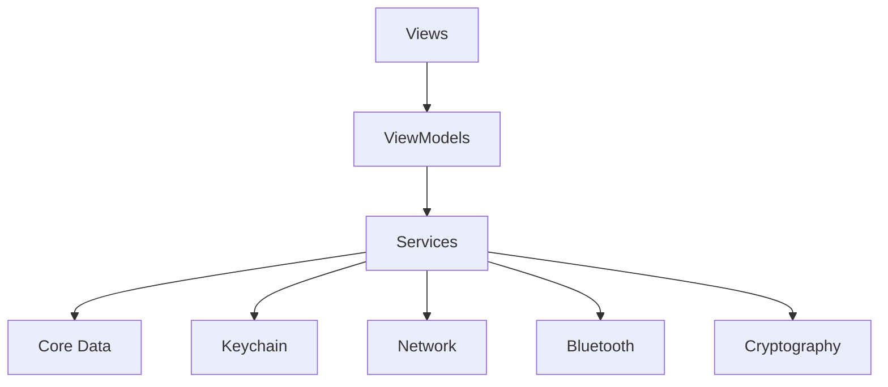

# iOS Mobile App Documentation

## 🎯 Overview

The Offline Blockchain Wallet iOS app is a SwiftUI-based mobile application that enables secure cryptocurrency transactions both online and offline. It supports peer-to-peer transactions via Bluetooth and QR codes, with automatic synchronization when network connectivity is restored.

## 📱 Features

- **Secure Wallet Management**: Create and manage cryptocurrency wallets
- **Offline Transactions**: Send and receive payments without internet connectivity
- **Bluetooth Communication**: Peer-to-peer transactions via Bluetooth LE
- **QR Code Integration**: Generate and scan QR codes for payments
- **Biometric Authentication**: Touch ID / Face ID support
- **Background Services**: Automatic synchronization and token management
- **Dark Mode Support**: Adaptive UI for light and dark themes

## 🚀 Quick Start

### Prerequisites

- Xcode 15.0+
- iOS 15.0+
- macOS 12.0+ (for development)
- Apple Developer Account (for device testing)

### Installation

```bash
# Clone the repository
git clone <repository-url>
cd ios/offline-blockchain-wallet-ios

# Configure the project
./configure_project.sh

# Resolve Swift Package dependencies
swift package resolve

# Open in Xcode
open offline-blockchain-wallet-ios.xcodeproj
```

### Build and Run

```bash
# Build for simulator
xcodebuild -scheme offline-blockchain-wallet-ios \\
  -destination 'platform=iOS Simulator,name=iPhone 15,OS=latest' \\
  build

# Run tests
swift test

# Build for device
./scripts/build.sh --device
```

## 📁 Project Structure

```
ios/offline-blockchain-wallet-ios/
├── offline-blockchain-wallet-ios/
│   ├── Views/                      # SwiftUI Views
│   │   ├── WalletView.swift
│   │   ├── TransactionView.swift
│   │   ├── QRScannerView.swift
│   │   ├── QRCodeDisplayView.swift
│   │   └── SettingsView.swift
│   ├── ViewModels/                 # MVVM ViewModels
│   │   ├── WalletViewModel.swift
│   │   └── TransactionViewModel.swift
│   ├── Services/                   # Business Logic Services
│   │   ├── NetworkService.swift
│   │   ├── CryptographyService.swift
│   │   ├── StorageService.swift
│   │   ├── BluetoothService.swift
│   │   ├── QRCodeService.swift
│   │   ├── OfflineTokenService.swift
│   │   ├── TransactionService.swift
│   │   ├── BackupService.swift
│   │   ├── DataSyncService.swift
│   │   ├── BackgroundTaskManager.swift
│   │   ├── BackgroundServiceCoordinator.swift
│   │   ├── BackgroundBluetoothService.swift
│   │   ├── PushNotificationService.swift
│   │   └── QRBluetoothIntegrationService.swift
│   ├── Models/                     # Data Models
│   │   ├── OfflineToken.swift
│   │   ├── QRCodeData.swift
│   │   ├── BluetoothModels.swift
│   │   └── BackgroundServiceTypes.swift
│   ├── Utils/                      # Utility Classes
│   │   ├── Constants.swift
│   │   ├── Logger.swift
│   │   ├── ErrorHandler.swift
│   │   └── ThemeManager.swift
│   ├── Configuration/              # App Configuration
│   │   ├── BuildConfiguration.swift
│   │   ├── Debug.xcconfig
│   │   └── Release.xcconfig
│   ├── Models/                     # Core Data Models
│   │   └── WalletDataModel.xcdatamodeld/
│   ├── ContentView.swift           # Main App View
│   ├── offline_blockchain_wallet_iosApp.swift  # App Entry Point
│   ├── Info.plist                  # App Configuration
│   └── LaunchScreen.storyboard     # Launch Screen
├── Tests/                          # Unit Tests
│   └── OfflineBlockchainWalletTests/
│       ├── CryptographyServiceTests.swift
│       ├── StorageServiceTests.swift
│       ├── BluetoothServiceTests.swift
│       ├── QRCodeServiceTests.swift
│       ├── OfflineTokenServiceTests.swift
│       ├── TransactionServiceTests.swift
│       ├── NetworkServiceTests.swift
│       └── WalletViewModelTests.swift
├── Scripts/                        # Build Scripts
│   ├── build.sh
│   ├── fix_build_issues.sh
│   ├── fix_dependencies_safely.sh
│   └── device-testing-automation.sh
├── Package.swift                   # Swift Package Manager
├── README.md
├── XCODE_SETUP.md
├── TROUBLESHOOTING.md
└── configure_project.sh
```

## 🏗️ Architecture

### MVVM Pattern

The app follows the Model-View-ViewModel (MVVM) architectural pattern:

```swift
// Model
struct OfflineToken: Codable {
    let id: String
    let amount: Double
    let signature: String
    let expiresAt: Date
    var isSpent: Bool
}

// ViewModel
class WalletViewModel: ObservableObject {
    @Published var balance: Double = 0.0
    @Published var tokens: [OfflineToken] = []
    
    private let walletService: WalletService
    
    func refreshBalance() {
        // Update balance from service
    }
}

// View
struct WalletView: View {
    @StateObject private var viewModel = WalletViewModel()
    
    var body: some View {
        VStack {
            Text(\"Balance: \\(viewModel.balance)\")
            // UI components
        }
        .onAppear {
            viewModel.refreshBalance()
        }
    }
}
```

### Service Layer Architecture



## 🔧 Core Services

### Network Service

Handles all API communication with the backend.

```swift
class NetworkService: NetworkServiceProtocol {
    private let baseURL: String
    private let session: URLSession
    
    func authenticateUser(email: String, password: String) async throws -> AuthResponse {
        let request = AuthRequest(email: email, password: password)
        return try await post(\"/auth/login\", body: request)
    }
    
    func getWalletBalance(walletId: String) async throws -> WalletBalanceResponse {
        return try await get(\"/wallet/balance\")
    }
    
    func purchaseTokens(amount: Double) async throws -> TokenPurchaseResponse {
        let request = TokenPurchaseRequest(amount: amount)
        return try await post(\"/wallet/purchase\", body: request)
    }
}
```

### Cryptography Service

Provides cryptographic operations for secure transactions.

```swift
class CryptographyService {
    func generateKeyPair() throws -> (privateKey: SecKey, publicKey: SecKey) {
        let attributes: [String: Any] = [
            kSecAttrKeyType as String: kSecAttrKeyTypeECSECPrimeRandom,
            kSecAttrKeySizeInBits as String: 256
        ]
        
        var publicKey, privateKey: SecKey?
        let status = SecKeyGeneratePair(attributes as CFDictionary, &publicKey, &privateKey)
        
        guard status == errSecSuccess,
              let pubKey = publicKey,
              let privKey = privateKey else {
            throw CryptographyError.keyGenerationFailed
        }
        
        return (privKey, pubKey)
    }
    
    func signData(_ data: Data, with privateKey: SecKey) throws -> Data {
        var error: Unmanaged<CFError>?
        guard let signature = SecKeyCreateSignature(
            privateKey,
            .ecdsaSignatureMessageX962SHA256,
            data as CFData,
            &error
        ) else {
            throw CryptographyError.signingFailed
        }
        
        return signature as Data
    }
    
    func verifySignature(_ signature: Data, for data: Data, with publicKey: SecKey) -> Bool {
        var error: Unmanaged<CFError>?
        return SecKeyVerifySignature(
            publicKey,
            .ecdsaSignatureMessageX962SHA256,
            data as CFData,
            signature as CFData,
            &error
        )
    }
}
```

### Storage Service

Manages local data persistence using Core Data and Keychain.

```swift
class StorageService: StorageServiceProtocol {
    private lazy var persistentContainer: NSPersistentContainer = {
        let container = NSPersistentContainer(name: \"WalletDataModel\")
        container.loadPersistentStores { _, error in
            if let error = error {
                Logger.shared.error(\"Core Data error: \\(error)\")
            }
        }
        return container
    }()
    
    func saveOfflineTokens(_ tokens: [OfflineToken]) async throws {
        let context = persistentContainer.viewContext
        
        for token in tokens {
            let entity = OfflineTokenEntity(context: context)
            entity.id = token.id
            entity.amount = token.amount
            entity.signature = token.signature
            entity.expiresAt = token.expiresAt
            entity.isSpent = token.isSpent
        }
        
        try context.save()
    }
    
    func loadOfflineTokens() async throws -> [OfflineToken] {
        let context = persistentContainer.viewContext
        let request: NSFetchRequest<OfflineTokenEntity> = OfflineTokenEntity.fetchRequest()
        
        let entities = try context.fetch(request)
        return entities.map { entity in
            OfflineToken(
                id: entity.id ?? \"\",
                amount: entity.amount,
                signature: entity.signature ?? \"\",
                expiresAt: entity.expiresAt ?? Date(),
                isSpent: entity.isSpent
            )
        }
    }
    
    func storePrivateKey(_ key: SecKey, for identifier: String) throws {
        let keychain = Keychain(service: \"com.wallet.app\")
        let keyData = try keyToData(key)
        try keychain.set(keyData, key: \"privateKey_\\(identifier)\")
    }
}
```

### Bluetooth Service

Enables peer-to-peer communication via Bluetooth LE.

```swift
class BluetoothService: NSObject, BluetoothServiceProtocol {
    private var centralManager: CBCentralManager!
    private var peripheralManager: CBPeripheralManager!
    private let serviceUUID = CBUUID(string: \"12345678-1234-1234-1234-123456789ABC\")
    
    func startAdvertising(walletInfo: WalletInfo) throws {
        let advertisementData: [String: Any] = [
            CBAdvertisementDataServiceUUIDsKey: [serviceUUID],
            CBAdvertisementDataLocalNameKey: \"Wallet_\\(walletInfo.walletId.prefix(8))\"
        ]
        
        peripheralManager.startAdvertising(advertisementData)
        Logger.shared.info(\"Started advertising wallet: \\(walletInfo.walletId)\")
    }
    
    func scanForDevices() async throws -> [BluetoothDevice] {
        return await withCheckedThrowingContinuation { continuation in
            discoveredDevices = []
            scanContinuation = continuation
            
            centralManager.scanForPeripherals(
                withServices: [serviceUUID],
                options: [CBCentralManagerScanOptionAllowDuplicatesKey: false]
            )
            
            // Timeout after 10 seconds
            DispatchQueue.main.asyncAfter(deadline: .now() + 10) {
                self.centralManager.stopScan()
                continuation.resume(returning: self.discoveredDevices)
            }
        }
    }
    
    func sendData(_ data: Data, to connection: BluetoothConnection) async throws {
        guard let peripheral = connection.peripheral,
              let characteristic = connection.characteristic else {
            throw BluetoothError.invalidConnection
        }
        
        peripheral.writeValue(
            data,
            for: characteristic,
            type: .withResponse
        )
    }
}
```

### QR Code Service

Handles QR code generation and scanning for payments.

```swift
class QRCodeService {
    func generateQRCode(for paymentRequest: QRCodePaymentRequest) throws -> UIImage {
        let encoder = JSONEncoder()
        let jsonData = try encoder.encode(paymentRequest)
        
        guard let filter = CIFilter(name: \"CIQRCodeGenerator\") else {
            throw QRCodeError.generationFailed
        }
        
        filter.setValue(jsonData, forKey: \"inputMessage\")
        filter.setValue(\"M\", forKey: \"inputCorrectionLevel\")
        
        guard let outputImage = filter.outputImage else {
            throw QRCodeError.generationFailed
        }
        
        let transform = CGAffineTransform(scaleX: 10, y: 10)
        let scaledImage = outputImage.transformed(by: transform)
        
        let context = CIContext()
        guard let cgImage = context.createCGImage(scaledImage, from: scaledImage.extent) else {
            throw QRCodeError.generationFailed
        }
        
        return UIImage(cgImage: cgImage)
    }
    
    func parseQRCode(_ string: String) throws -> QRCodePaymentRequest {
        guard let data = string.data(using: .utf8) else {
            throw QRCodeError.invalidFormat
        }
        
        let decoder = JSONDecoder()
        return try decoder.decode(QRCodePaymentRequest.self, from: data)
    }
    
    func validateQRCode(_ paymentRequest: QRCodePaymentRequest) -> QRCodeValidationResult {
        var errors: [String] = []
        
        // Validate timestamp (not older than 5 minutes)
        if Date().timeIntervalSince(paymentRequest.timestamp) > 300 {
            errors.append(\"QR code has expired\")
        }
        
        // Validate amount
        if paymentRequest.amount <= 0 {
            errors.append(\"Invalid payment amount\")
        }
        
        // Validate wallet ID format
        if paymentRequest.walletId.isEmpty {
            errors.append(\"Invalid wallet ID\")
        }
        
        return QRCodeValidationResult(
            isValid: errors.isEmpty,
            errors: errors
        )
    }
}
```

### Offline Token Service

Manages offline token operations and validation.

```swift
class OfflineTokenService: OfflineTokenServiceProtocol {
    private let cryptographyService: CryptographyService
    private let storageService: StorageService
    
    func validateToken(_ token: OfflineToken) -> Bool {
        // Check if token is expired
        if token.expiresAt < Date() {
            return false
        }
        
        // Check if token is already spent
        if token.isSpent {
            return false
        }
        
        // Verify signature
        return verifyTokenSignature(token)
    }
    
    func divideToken(_ token: OfflineToken, amount: Double) throws -> TokenDivisionResult {
        guard validateToken(token) else {
            throw TokenError.invalidToken
        }
        
        guard amount > 0 && amount < token.amount else {
            throw TokenError.invalidAmount
        }
        
        let paymentToken = OfflineToken(
            id: UUID().uuidString,
            amount: amount,
            signature: try generateTokenSignature(amount: amount),
            expiresAt: token.expiresAt,
            isSpent: false
        )
        
        let changeAmount = token.amount - amount
        let changeToken = OfflineToken(
            id: UUID().uuidString,
            amount: changeAmount,
            signature: try generateTokenSignature(amount: changeAmount),
            expiresAt: token.expiresAt,
            isSpent: false
        )
        
        // Mark original token as spent
        try markTokenAsSpent(token.id)
        
        return TokenDivisionResult(
            paymentToken: paymentToken,
            changeToken: changeToken
        )
    }
    
    func calculateOfflineBalance() async throws -> Double {
        let tokens = try await storageService.loadOfflineTokens()
        return tokens
            .filter { !$0.isSpent && $0.expiresAt > Date() }
            .reduce(0) { $0 + $1.amount }
    }
}
```

## 📱 User Interface

### Main Wallet View

```swift
struct WalletView: View {
    @StateObject private var walletViewModel: WalletViewModel
    @State private var showingSettings = false
    @State private var showingTransactionView = false
    
    var body: some View {
        NavigationView {
            ScrollView {
                VStack(spacing: 20) {
                    balanceSection
                    quickActionsSection
                    recentTransactionsSection
                }
                .padding()
            }
            .navigationTitle(\"Wallet\")
            .navigationBarTitleDisplayMode(.large)
            .toolbar {
                ToolbarItem(placement: .navigationBarTrailing) {
                    Button(action: {
                        showingSettings = true
                    }) {
                        Image(systemName: \"gear\")
                    }
                }
            }
            .sheet(isPresented: $showingSettings) {
                SettingsView()
            }
            .sheet(isPresented: $showingTransactionView) {
                TransactionView()
            }
        }
    }
    
    private var balanceSection: some View {
        VStack(spacing: 16) {
            HStack {
                VStack(alignment: .leading) {
                    Text(\"Total Balance\")
                        .font(.headline)
                        .foregroundColor(.secondary)
                    
                    HStack(alignment: .firstTextBaseline, spacing: 4) {
                        Text(\"$\")
                            .font(.title2)
                            .foregroundColor(.primary)
                        Text(String(format: \"%.2f\", walletViewModel.totalBalance))
                            .font(.system(size: 36, weight: .bold, design: .rounded))
                            .foregroundColor(.primary)
                            .contentTransition(.numericText())
                    }
                }
                Spacer()
                
                VStack {
                    Image(systemName: walletViewModel.isOnline ? \"wifi\" : \"wifi.slash\")
                        .foregroundColor(walletViewModel.isOnline ? .green : .orange)
                    Text(walletViewModel.isOnline ? \"Online\" : \"Offline\")
                        .font(.caption)
                        .foregroundColor(.secondary)
                }
            }
            
            HStack(spacing: 20) {
                BalanceCard(
                    title: \"Blockchain\",
                    amount: walletViewModel.blockchainBalance,
                    color: .blue
                )
                
                BalanceCard(
                    title: \"Offline\",
                    amount: walletViewModel.offlineBalance,
                    color: .green
                )
            }
        }
        .padding()
        .background(Color.adaptiveCardBackground)
        .cornerRadius(16)
    }
    
    private var quickActionsSection: some View {
        HStack(spacing: 16) {
            QuickActionButton(
                title: \"Send\",
                icon: \"arrow.up.circle.fill\",
                color: .red
            ) {
                showingTransactionView = true
            }
            
            QuickActionButton(
                title: \"Receive\",
                icon: \"arrow.down.circle.fill\",
                color: .green
            ) {
                // Show receive view
            }
            
            QuickActionButton(
                title: \"Purchase\",
                icon: \"plus.circle.fill\",
                color: .blue
            ) {
                // Show purchase view
            }
            
            QuickActionButton(
                title: \"Scan\",
                icon: \"qrcode.viewfinder\",
                color: .purple
            ) {
                // Show QR scanner
            }
        }
    }
}
```

### Transaction View

```swift
struct TransactionView: View {
    @StateObject private var transactionViewModel = TransactionViewModel()
    @Environment(\\.dismiss) private var dismiss
    @State private var selectedTab = 0
    
    var body: some View {
        NavigationView {
            VStack {
                Picker(\"Transaction Type\", selection: $selectedTab) {
                    Text(\"Send\").tag(0)
                    Text(\"Request\").tag(1)
                }
                .pickerStyle(SegmentedPickerStyle())
                .padding()
                
                TabView(selection: $selectedTab) {
                    SendTransactionView(viewModel: transactionViewModel)
                        .tag(0)
                    
                    RequestTransactionView(viewModel: transactionViewModel)
                        .tag(1)
                }
                .tabViewStyle(PageTabViewStyle(indexDisplayMode: .never))
            }
            .navigationTitle(\"Transactions\")
            .toolbar {
                ToolbarItem(placement: .topBarLeading) {
                    Button(\"Close\") {
                        dismiss()
                    }
                }
            }
        }
    }
}

struct SendTransactionView: View {
    @ObservedObject var viewModel: TransactionViewModel
    @State private var showingQRScanner = false
    @State private var showingBluetoothDevices = false
    
    var body: some View {
        VStack(spacing: 24) {
            // Amount input
            VStack(alignment: .leading, spacing: 8) {
                Text(\"Amount\")
                    .font(.headline)
                
                HStack {
                    Text(\"$\")
                        .font(.title2)
                        .foregroundColor(.secondary)
                    
                    TextField(\"0.00\", text: $transactionViewModel.amount)
                        .textFieldStyle(RoundedBorderTextFieldStyle())
                        .keyboardType(.decimalPad)
                        .font(.system(size: 24, weight: .semibold, design: .rounded))
                        .multilineTextAlignment(.center)
                }
            }
            
            // Recipient input
            VStack(alignment: .leading, spacing: 8) {
                Text(\"Recipient\")
                    .font(.headline)
                
                HStack {
                    TextField(\"Wallet address or scan QR\", text: $viewModel.recipientAddress)
                        .textFieldStyle(RoundedBorderTextFieldStyle())
                    
                    Button(action: {
                        showingQRScanner = true
                    }) {
                        Image(systemName: \"qrcode.viewfinder\")
                            .font(.title2)
                    }
                }
            }
            
            // Send methods
            VStack(alignment: .leading, spacing: 12) {
                Text(\"Send Method\")
                    .font(.headline)
                
                HStack(spacing: 16) {
                    SendMethodButton(
                        title: \"QR Code\",
                        icon: \"qrcode\",
                        isSelected: viewModel.selectedMethod == .qrCode
                    ) {
                        viewModel.selectedMethod = .qrCode
                    }
                    
                    SendMethodButton(
                        title: \"Bluetooth\",
                        icon: \"bluetooth\",
                        isSelected: viewModel.selectedMethod == .bluetooth
                    ) {
                        viewModel.selectedMethod = .bluetooth
                        showingBluetoothDevices = true
                    }
                    
                    SendMethodButton(
                        title: \"Online\",
                        icon: \"wifi\",
                        isSelected: viewModel.selectedMethod == .online
                    ) {
                        viewModel.selectedMethod = .online
                    }
                }
            }
            
            Spacer()
            
            // Send button
            Button(action: {
                Task {
                    await viewModel.sendTransaction()
                }
            }) {
                HStack {
                    if viewModel.isProcessing {
                        ProgressView()
                            .progressViewStyle(CircularProgressViewStyle(tint: .white))
                            .scaleEffect(0.8)
                    }
                    
                    Text(viewModel.isProcessing ? \"Processing...\" : \"Send Payment\")
                        .font(.headline)
                        .foregroundColor(.white)
                }
                .frame(maxWidth: .infinity)
                .padding()
                .background(viewModel.canSend ? Color.blue : Color.gray)
                .cornerRadius(12)
            }
            .disabled(!viewModel.canSend || viewModel.isProcessing)
        }
        .padding()
        .sheet(isPresented: $showingQRScanner) {
            QRScannerView { result in
                viewModel.recipientAddress = result
                showingQRScanner = false
            }
        }
        .sheet(isPresented: $showingBluetoothDevices) {
            BluetoothDeviceListView(viewModel: viewModel)
        }
    }
}
```

## 🔒 Security Implementation

### Biometric Authentication

```swift
import LocalAuthentication

class BiometricAuthService {
    func authenticateUser() async throws -> Bool {
        let context = LAContext()
        var error: NSError?
        
        guard context.canEvaluatePolicy(.deviceOwnerAuthenticationWithBiometrics, error: &error) else {
            throw BiometricError.notAvailable
        }
        
        let reason = \"Authenticate to access your wallet\"
        
        return try await withCheckedThrowingContinuation { continuation in
            context.evaluatePolicy(
                .deviceOwnerAuthenticationWithBiometrics,
                localizedReason: reason
            ) { success, error in
                if let error = error {
                    continuation.resume(throwing: error)
                } else {
                    continuation.resume(returning: success)
                }
            }
        }
    }
}
```

### Keychain Storage

```swift
import KeychainAccess

class SecureStorage {
    private let keychain = Keychain(service: \"com.wallet.app\")
        .accessibility(.whenUnlockedThisDeviceOnly)
    
    func storePrivateKey(_ key: Data, for identifier: String) throws {
        try keychain.set(key, key: \"privateKey_\\(identifier)\")
    }
    
    func retrievePrivateKey(for identifier: String) throws -> Data? {
        return try keychain.getData(\"privateKey_\\(identifier)\")
    }
    
    func storeAuthToken(_ token: String) throws {
        try keychain.set(token, key: \"authToken\")
    }
    
    func retrieveAuthToken() throws -> String? {
        return try keychain.get(\"authToken\")
    }
    
    func clearAll() throws {
        try keychain.removeAll()
    }
}
```

## 🧪 Testing

### Unit Tests

```swift
import XCTest
@testable import offline_blockchain_wallet_ios

class CryptographyServiceTests: XCTestCase {
    var cryptographyService: CryptographyService!
    
    override func setUp() {
        super.setUp()
        cryptographyService = CryptographyService()
    }
    
    func testKeyGeneration() throws {
        let (privateKey, publicKey) = try cryptographyService.generateKeyPair()
        
        XCTAssertNotNil(privateKey)
        XCTAssertNotNil(publicKey)
    }
    
    func testSignatureCreationAndVerification() throws {
        let (privateKey, publicKey) = try cryptographyService.generateKeyPair()
        let testData = \"Hello, World!\".data(using: .utf8)!
        
        let signature = try cryptographyService.signData(testData, with: privateKey)
        let isValid = cryptographyService.verifySignature(signature, for: testData, with: publicKey)
        
        XCTAssertTrue(isValid)
    }
    
    func testInvalidSignatureRejection() throws {
        let (privateKey1, _) = try cryptographyService.generateKeyPair()
        let (_, publicKey2) = try cryptographyService.generateKeyPair()
        let testData = \"Hello, World!\".data(using: .utf8)!
        
        let signature = try cryptographyService.signData(testData, with: privateKey1)
        let isValid = cryptographyService.verifySignature(signature, for: testData, with: publicKey2)
        
        XCTAssertFalse(isValid)
    }
}
```

### Integration Tests

```swift
class NetworkServiceIntegrationTests: XCTestCase {
    var networkService: NetworkService!
    
    override func setUp() {
        super.setUp()
        let config = URLSessionConfiguration.default
        config.protocolClasses = [MockURLProtocol.self]
        let session = URLSession(configuration: config)
        networkService = NetworkService(session: session)
    }
    
    func testUserAuthentication() async throws {
        // Mock successful authentication response
        MockURLProtocol.mockResponse = AuthResponse(
            user: User(id: \"123\", username: \"test\", email: \"test@example.com\"),
            tokens: Tokens(accessToken: \"token123\", refreshToken: \"refresh123\")
        )
        
        let response = try await networkService.authenticateUser(
            email: \"test@example.com\",
            password: \"password123\"
        )
        
        XCTAssertEqual(response.user.email, \"test@example.com\")
        XCTAssertFalse(response.tokens.accessToken.isEmpty)
    }
}
```

### UI Tests

```swift
class WalletUITests: XCTestCase {
    var app: XCUIApplication!
    
    override func setUp() {
        super.setUp()
        app = XCUIApplication()
        app.launch()
    }
    
    func testWalletBalanceDisplay() {
        let balanceLabel = app.staticTexts[\"Total Balance\"]
        XCTAssertTrue(balanceLabel.exists)
        
        let balanceAmount = app.staticTexts.matching(NSPredicate(format: \"label CONTAINS '$'\")).firstMatch
        XCTAssertTrue(balanceAmount.exists)
    }
    
    func testSendTransactionFlow() {
        app.buttons[\"Send\"].tap()
        
        let amountField = app.textFields[\"0.00\"]
        amountField.tap()
        amountField.typeText(\"25.00\")
        
        let recipientField = app.textFields[\"Wallet address or scan QR\"]
        recipientField.tap()
        recipientField.typeText(\"0x742d35Cc6634C0532925a3b8D404d3aAB451e9c\")
        
        app.buttons[\"Send Payment\"].tap()
        
        // Verify transaction confirmation
        let confirmationAlert = app.alerts[\"Confirm Transaction\"]
        XCTAssertTrue(confirmationAlert.waitForExistence(timeout: 5))
    }
}
```

## 🔧 Configuration

### Build Configurations

#### Debug Configuration (Debug.xcconfig)
```
API_BASE_URL = https://dev-api.wallet.com
LOG_LEVEL = DEBUG
ENABLE_MOCK_SERVICES = YES
BLUETOOTH_TIMEOUT = 30
QR_CODE_TIMEOUT = 300
TOKEN_EXPIRY_DAYS = 30
```

#### Release Configuration (Release.xcconfig)
```
API_BASE_URL = https://api.wallet.com
LOG_LEVEL = ERROR
ENABLE_MOCK_SERVICES = NO
BLUETOOTH_TIMEOUT = 10
QR_CODE_TIMEOUT = 60
TOKEN_EXPIRY_DAYS = 7
```

### Info.plist Configuration

```xml
<?xml version=\"1.0\" encoding=\"UTF-8\"?>
<!DOCTYPE plist PUBLIC \"-//Apple//DTD PLIST 1.0//EN\" \"http://www.apple.com/DTDs/PropertyList-1.0.dtd\">
<plist version=\"1.0\">
<dict>
    <key>CFBundleDisplayName</key>
    <string>Offline Wallet</string>
    <key>CFBundleIdentifier</key>
    <string>com.company.offline-blockchain-wallet</string>
    <key>CFBundleVersion</key>
    <string>1.0.0</string>
    
    <!-- Camera permission for QR scanning -->
    <key>NSCameraUsageDescription</key>
    <string>This app needs camera access to scan QR codes for payments</string>
    
    <!-- Bluetooth permission -->
    <key>NSBluetoothAlwaysUsageDescription</key>
    <string>This app uses Bluetooth to enable offline peer-to-peer transactions</string>
    <key>NSBluetoothPeripheralUsageDescription</key>
    <string>This app uses Bluetooth to enable offline peer-to-peer transactions</string>
    
    <!-- Face ID permission -->
    <key>NSFaceIDUsageDescription</key>
    <string>Use Face ID to authenticate and access your wallet</string>
    
    <!-- Background modes -->
    <key>UIBackgroundModes</key>
    <array>
        <string>bluetooth-central</string>
        <string>bluetooth-peripheral</string>
        <string>background-processing</string>
    </array>
    
    <!-- App Transport Security -->
    <key>NSAppTransportSecurity</key>
    <dict>
        <key>NSAllowsArbitraryLoads</key>
        <false/>
        <key>NSExceptionDomains</key>
        <dict>
            <key>api.wallet.com</key>
            <dict>
                <key>NSExceptionRequiresForwardSecrecy</key>
                <false/>
                <key>NSExceptionMinimumTLSVersion</key>
                <string>TLSv1.2</string>
            </dict>
        </dict>
    </dict>
</dict>
</plist>
```

## 🚀 Deployment

### App Store Deployment

#### 1. Prepare for Release

```bash
# Update version and build number
./scripts/update-version.sh 1.0.0

# Switch to release configuration
xed . # Open in Xcode
# Product -> Scheme -> Edit Scheme -> Run -> Build Configuration -> Release
```

#### 2. Archive and Export

```bash
# Archive for App Store
xcodebuild archive \\
  -scheme offline-blockchain-wallet-ios \\
  -configuration Release \\
  -destination generic/platform=iOS \\
  -archivePath build/offline-blockchain-wallet-ios.xcarchive

# Export for App Store
xcodebuild -exportArchive \\
  -archivePath build/offline-blockchain-wallet-ios.xcarchive \\
  -exportPath build/AppStore \\
  -exportOptionsPlist ExportOptions.plist
```

#### 3. Upload to App Store Connect

```bash
# Upload using Transporter or altool
xcrun altool --upload-app \\
  -f build/AppStore/offline-blockchain-wallet-ios.ipa \\
  -u your-apple-id@example.com \\
  -p @keychain:AC_PASSWORD
```

### TestFlight Distribution

```bash
# Export for TestFlight
xcodebuild -exportArchive \\
  -archivePath build/offline-blockchain-wallet-ios.xcarchive \\
  -exportPath build/TestFlight \\
  -exportOptionsPlist TestFlightExportOptions.plist

# Upload to TestFlight
xcrun altool --upload-app \\
  -f build/TestFlight/offline-blockchain-wallet-ios.ipa \\
  -u your-apple-id@example.com \\
  -p @keychain:AC_PASSWORD
```

## 🔍 Troubleshooting

### Common Build Issues

#### Dependency Resolution
```bash
# Clear Swift Package Manager cache
rm -rf ~/Library/Caches/org.swift.swiftpm
rm -rf .build

# Reset packages
swift package reset
swift package resolve
```

#### Code Signing Issues
```bash
# Check provisioning profiles
security find-identity -v -p codesigning

# Clean derived data
rm -rf ~/Library/Developer/Xcode/DerivedData

# Fix signing issues
./scripts/fix_build_issues.sh
```

### Runtime Issues

#### Bluetooth Not Working
```swift
// Check Bluetooth permissions
if CBCentralManager.authorization != .allowedAlways {
    // Request permissions in Info.plist
}

// Reset Bluetooth state
bluetoothService.reset()
```

#### Keychain Access Issues
```swift
// Clear keychain data
let keychain = Keychain(service: \"com.wallet.app\")
try keychain.removeAll()

// Check keychain accessibility
let accessibility = keychain.accessibility
print(\"Keychain accessibility: \\(accessibility)\")
```

#### Core Data Issues
```swift
// Reset Core Data store
let storeURL = persistentContainer.persistentStoreDescriptions.first?.url
if let url = storeURL {
    try persistentContainer.persistentStoreCoordinator.destroyPersistentStore(
        at: url,
        ofType: NSSQLiteStoreType,
        options: nil
    )
}
```

### Performance Issues

#### Memory Leaks
```swift
// Use weak references in closures
service.performOperation { [weak self] result in
    self?.handleResult(result)
}

// Properly dispose of observers
deinit {
    NotificationCenter.default.removeObserver(self)
}
```

#### Battery Usage
```swift
// Optimize Bluetooth scanning
func optimizeBluetooth() {
    // Scan only when needed
    centralManager.scanForPeripherals(
        withServices: [serviceUUID],
        options: [CBCentralManagerScanOptionAllowDuplicatesKey: false]
    )
    
    // Stop scanning after timeout
    DispatchQueue.main.asyncAfter(deadline: .now() + 10) {
        self.centralManager.stopScan()
    }
}
```

## 📚 Additional Resources

### Documentation
- [Apple Developer Documentation](https://developer.apple.com/documentation/)
- [SwiftUI Documentation](https://developer.apple.com/documentation/swiftui)
- [Core Data Documentation](https://developer.apple.com/documentation/coredata)
- [CryptoKit Documentation](https://developer.apple.com/documentation/cryptokit)

### Sample Code
- [Bluetooth LE Implementation](./BLUETOOTH_IMPLEMENTATION_SUMMARY.md)
- [Cryptography Service](./CRYPTOGRAPHY_IMPLEMENTATION_SUMMARY.md)
- [Background Services](./BACKGROUND_SERVICES_IMPLEMENTATION.md)
- [Transaction Service](./TRANSACTION_SERVICE_IMPLEMENTATION.md)

### Testing Resources
- [Device Testing Matrix](./DEVICE_TESTING_MATRIX.md)
- [Xcode Setup Guide](./XCODE_SETUP.md)
- [Troubleshooting Guide](./TROUBLESHOOTING.md)

---

*This documentation is maintained by the iOS development team and updated with each release. For questions or contributions, please contact the development team.*
"