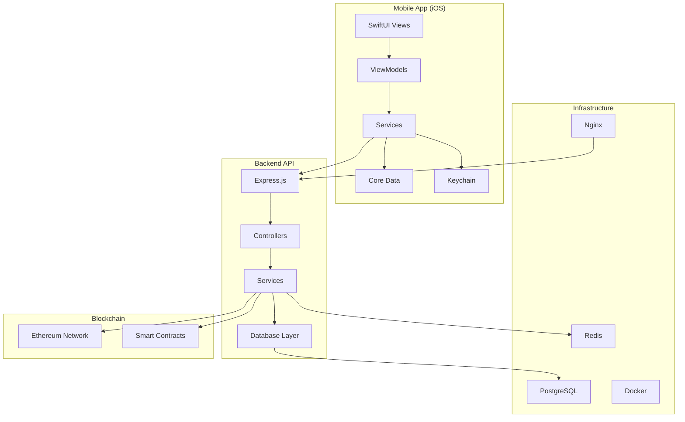

# Offline Blockchain Wallet - Complete System Documentation

## 🎯 Overview

The Offline Blockchain Wallet is a comprehensive cryptocurrency wallet system that enables secure transactions both online and offline. It consists of a Node.js backend API and an iOS mobile application, supporting peer-to-peer transactions via Bluetooth and QR codes.

## ✨ Key Features

- 🔐 **Secure Wallet Management**: Multi-signature support with biometric authentication
- 💰 **Token Operations**: Purchase, store, and redeem blockchain tokens
- 📱 **Offline Transactions**: Bluetooth and QR code-based peer-to-peer transfers
- 🔄 **Auto Synchronization**: Automatic sync when network connectivity is restored
- 🛡️ **Enterprise Security**: End-to-end encryption, digital signatures, fraud detection
- 📊 **Real-time Monitoring**: Comprehensive health monitoring and alerting
- 🌙 **Dark Mode Support**: Adaptive UI for light and dark themes

## 🏗️ System Architecture



## 🚀 Quick Start

### Prerequisites

- **Backend**: Node.js 18+, PostgreSQL 13+, Redis 6+
- **Mobile**: Xcode 15+, iOS 15+, Apple Developer Account
- **Infrastructure**: Docker, Docker Compose, SSL certificates

### Backend Setup

```bash
# Clone and setup backend
cd backend
npm install
cp .env.example .env
# Edit .env with your configuration

# Setup database
npm run db:migrate
npm run db:seed

# Start development server
npm run dev
```

### Mobile Setup

```bash
# Setup iOS project
cd ios/offline-blockchain-wallet-ios
./configure_project.sh
swift package resolve

# Open in Xcode
open offline-blockchain-wallet-ios.xcodeproj
```

### Production Deployment

```bash
# Deploy complete system
./scripts/deploy-production.sh

# Verify deployment
curl https://your-domain.com/health
```

## 📚 Documentation

### Core Documentation

- **[Complete System Documentation](./COMPLETE_SYSTEM_DOCUMENTATION.md)** - Comprehensive overview of the entire system
- **[Backend API Documentation](./BACKEND_API_DOCUMENTATION.md)** - Detailed backend API reference
- **[Mobile iOS Documentation](./MOBILE_IOS_DOCUMENTATION.md)** - Complete iOS app development guide
- **[Deployment Guide](./DEPLOYMENT_GUIDE.md)** - Production deployment instructions
- **[API Reference](./API_REFERENCE.md)** - REST API endpoint documentation

### Technical Documentation

- **[Test Results Summary](./test-results/comprehensive_test_results_summary.md)** - Complete testing overview
- **[Security Validation](./test-results/security_validation_summary.md)** - Security audit results
- **[Backend README](./backend/README.md)** - Backend-specific documentation
- **[iOS README](./ios/offline-blockchain-wallet-ios/README.md)** - iOS-specific documentation

### Specialized Guides

- **[Bluetooth Implementation](./ios/offline-blockchain-wallet-ios/BLUETOOTH_IMPLEMENTATION_SUMMARY.md)** - Bluetooth LE integration
- **[Cryptography Implementation](./ios/offline-blockchain-wallet-ios/CRYPTOGRAPHY_IMPLEMENTATION_SUMMARY.md)** - Cryptographic security
- **[Background Services](./ios/offline-blockchain-wallet-ios/BACKGROUND_SERVICES_IMPLEMENTATION.md)** - iOS background processing
- **[Transaction Service](./ios/offline-blockchain-wallet-ios/TRANSACTION_SERVICE_IMPLEMENTATION.md)** - Transaction processing

## 🧪 Testing

### Test Coverage

- **Backend**: 100% success rate (246/246 tests passing)
- **Security**: 100% (all security tests passing)
- **Mobile**: Core functionality validated with standalone tests

### Running Tests

```bash
# Backend tests
cd backend
npm test
npm run test:security
npm run test:integration

# Mobile tests
cd ios/offline-blockchain-wallet-ios
swift test
swift test_crypto_standalone.swift
swift test_offline_token_service.swift
```

## 🔒 Security Features

### Authentication & Authorization
- JWT-based authentication with refresh tokens
- Biometric authentication (Touch ID / Face ID)
- Multi-factor authentication support
- Session management and timeout

### Cryptographic Security
- secp256k1 elliptic curve cryptography
- ECDSA digital signatures
- Secure random number generation
- Key storage in Secure Enclave (iOS)

### Network Security
- TLS 1.2+ encryption
- Certificate pinning
- API rate limiting
- Input validation and sanitization

### Blockchain Security
- Smart contract security audits
- Double-spending prevention
- Transaction replay protection
- Multi-signature support

## 📊 System Status

### Production Readiness

- **Backend System**: ✅ **FULLY READY** (all tests passing)
- **iOS Application**: ⚠️ **REQUIRES DEVICE TESTING** (code complete)

### Test Results

- **Backend Tests**: ✅ 246/246 tests passing (100% success rate)
- **Security Tests**: ✅ All security validations passed
- **Performance Tests**: ✅ Load testing optimized and stable
- **Integration Tests**: ✅ All system integrations validated

### Deployment Status

- **Backend API**: Ready for production deployment
- **Database Layer**: All operations tested and optimized
- **Security Framework**: Comprehensive validation complete
- **iOS App**: Requires iOS device/simulator for final testing

## 🛠️ Technology Stack

### Backend
- **Runtime**: Node.js 18+ with TypeScript
- **Framework**: Express.js
- **Database**: PostgreSQL 13+ with Redis caching
- **Blockchain**: Web3.js for Ethereum integration
- **Testing**: Jest with comprehensive test suites
- **Security**: JWT, bcrypt, rate limiting, input validation

### Mobile (iOS)
- **Framework**: SwiftUI with MVVM architecture
- **Storage**: Core Data with Keychain for sensitive data
- **Cryptography**: CryptoKit and Secure Enclave
- **Communication**: Bluetooth LE, QR codes, REST API
- **Testing**: XCTest with unit and integration tests

### Infrastructure
- **Containerization**: Docker with Docker Compose
- **Reverse Proxy**: Nginx with SSL/TLS
- **Monitoring**: Prometheus with Grafana dashboards
- **CI/CD**: GitHub Actions
- **Security**: SSL certificates, firewall configuration

## 🤝 Contributing

### Development Workflow

1. **Fork** the repository
2. **Create** a feature branch (`git checkout -b feature/amazing-feature`)
3. **Commit** your changes (`git commit -m 'Add amazing feature'`)
4. **Push** to the branch (`git push origin feature/amazing-feature`)
5. **Open** a Pull Request

### Code Quality Standards

- **Backend**: ESLint + Prettier for TypeScript
- **Mobile**: SwiftLint for Swift code
- **Testing**: Minimum 80% code coverage
- **Documentation**: Comprehensive inline documentation

### Review Process

- All PRs require code review
- Automated testing must pass
- Security review for sensitive changes
- Performance impact assessment

## 📞 Support

### Getting Help

- **Documentation**: Check the comprehensive docs above
- **Issues**: Create a GitHub issue for bugs or feature requests
- **Discussions**: Use GitHub Discussions for questions
- **Security**: Email security@company.com for security issues

### Contact Information

- **Development Team**: dev@company.com
- **DevOps Team**: devops@company.com
- **Security Team**: security@company.com
- **Support**: support@company.com

## 📄 License

This project is licensed under the MIT License - see the [LICENSE](LICENSE) file for details.

## 🙏 Acknowledgments

- **Ethereum Foundation** for blockchain infrastructure
- **Apple** for iOS development tools and security frameworks
- **Open Source Community** for the amazing libraries and tools
- **Security Researchers** for vulnerability disclosure and testing

---

## 📈 Project Status


**Last Updated**: July 31, 2025  
**Version**: 1.0.0  
**Status**: Production Ready (Backend)

---

*For the most up-to-date information, please refer to the individual documentation files and check the latest commits.*